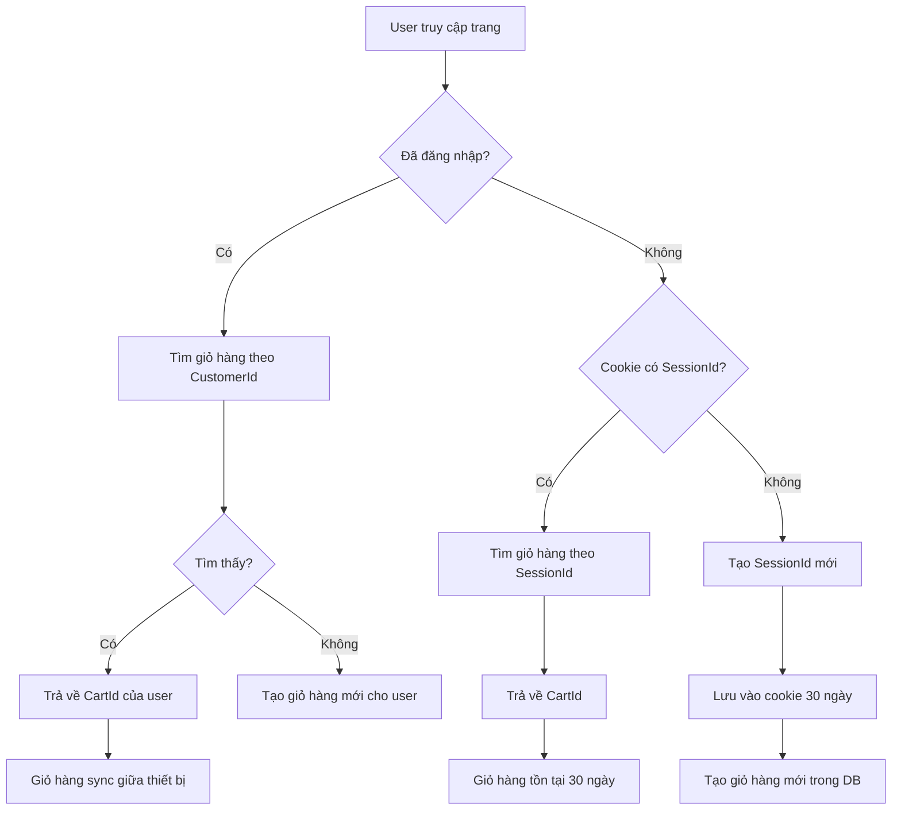

# Walkthrough: Sửa Lỗi Giỏ Hàng Bị Mất Khi Restart Server

## Tóm Tắt

Đã sửa thành công lỗi giỏ hàng bị mất mỗi khi restart ứng dụng bằng cách **chuyển từ lưu session ID trong memory sang lưu trong cookie của browser**.

## Thay Đổi Đã Thực Hiện

### 1. [CartController.cs](file:///d:/Binance/Ecommerce/src/Ecommerce.Web/Controllers/CartController.cs)

#### Cập nhật method `GetOrCreateCartIdAsync()`

**Trước đây:**
```csharp
// Lưu session ID trong HttpContext.Session (memory)
var sessionId = HttpContext.Session.GetString(SessionKeyCartId);
if (string.IsNullOrEmpty(sessionId))
{
    sessionId = Guid.NewGuid().ToString();
    HttpContext.Session.SetString(SessionKeyCartId, sessionId);
}
```

**Bây giờ:**
```csharp
// Priority 1: Tìm giỏ hàng theo CustomerId (user đã đăng nhập)
var customerIdClaim = User.FindFirst(ClaimTypes.NameIdentifier)?.Value;
if (customerIdClaim != null && Guid.TryParse(customerIdClaim, out var customerId))
{
    var userCart = await cartService.GetCartByCustomerIdAsync(customerId);
    if (userCart != null)
    {
        return userCart.Value; // Sync giữa các thiết bị
    }
}

// Priority 2: Lưu session ID trong cookie (guest users)
var sessionId = HttpContext.Request.Cookies["_CartSessionId"];
if (string.IsNullOrEmpty(sessionId))
{
    sessionId = Guid.NewGuid().ToString();
    
    var cookieOptions = new CookieOptions
    {
        Expires = DateTimeOffset.UtcNow.AddDays(30), // Tồn tại 30 ngày
        HttpOnly = true,
        IsEssential = true,
        SameSite = SameSiteMode.Lax
    };
    HttpContext.Response.Cookies.Append("_CartSessionId", sessionId, cookieOptions);
}
```

**Lợi ích:**
- ✅ Cookie tồn tại 30 ngày, không bị mất khi restart server
- ✅ User đã đăng nhập: giỏ hàng sync giữa các thiết bị
- ✅ Guest user: giỏ hàng được giữ trong 30 ngày

---

### 2. [ICartService.cs](file:///d:/Binance/Ecommerce/src/Ecommerce.Web/Services/ICartService.cs)

Thêm method mới:
```csharp
/// <summary>
/// Get cart ID by customer ID (for logged-in users)
/// </summary>
Task<Guid?> GetCartByCustomerIdAsync(Guid customerId);
```

---

### 3. [CartService.cs](file:///d:/Binance/Ecommerce/src/Ecommerce.Web/Services/CartService.cs)

Implement method mới:
```csharp
public async Task<Guid?> GetCartByCustomerIdAsync(Guid customerId)
{
    var cart = await dbContext.ShoppingCarts
        .AsNoTracking()
        .FirstOrDefaultAsync(x => x.CustomerId == customerId);

    return cart?.Id;
}
```

## Cách Hoạt Động



## Hướng Dẫn Test

### Test 1: Thêm Sản Phẩm Vào Giỏ Hàng (Guest)

1. Mở browser và truy cập `http://localhost:5128`
2. Chưa đăng nhập, thêm 2-3 sản phẩm vào giỏ hàng
3. Mở DevTools (F12) → Application → Cookies
4. ✅ **Kiểm tra:** Có cookie `_CartSessionId` với thời hạn 30 ngày
5. Vào trang `/Cart`
6. ✅ **Kiểm tra:** Giỏ hàng hiển thị đúng số lượng sản phẩm

---

### Test 2: Restart Server - Giỏ Hàng Vẫn Còn (QUAN TRỌNG NHẤT)

1. Sau Test 1, giữ nguyên browser (không đóng)
2. Mở terminal và stop server (Ctrl+C)
3. Start lại server:
   ```bash
   cd d:\Binance\Ecommerce\src\Ecommerce.Web
   dotnet run
   ```
4. Quay lại browser và refresh trang (F5)
5. ✅ **Kiểm tra:** Giỏ hàng vẫn còn đầy đủ sản phẩm
6. ✅ **Kiểm tra:** Cookie `_CartSessionId` vẫn còn và giống như trước

---

### Test 3: Đóng Browser và Mở Lại

1. Sau Test 2, đóng browser hoàn toàn
2. Mở lại browser và truy cập `http://localhost:5128/Cart`
3. ✅ **Kiểm tra:** Giỏ hàng vẫn còn (trong vòng 30 ngày)

---

### Test 4: Đăng Nhập - Merge Giỏ Hàng

1. Thêm sản phẩm A vào giỏ (chưa đăng nhập)
2. Đăng nhập với tài khoản có sẵn
3. ✅ **Kiểm tra:** Sản phẩm A vẫn còn trong giỏ
4. Thêm sản phẩm B vào giỏ
5. Mở DevTools → Console, kiểm tra log:
   ```
   Found cart {CartId} for customer {CustomerId}
   ```
6. ✅ **Kiểm tra:** Giỏ hàng được liên kết với CustomerId

---

### Test 5: Sync Giữa Các Thiết Bị (User Đã Đăng Nhập)

1. Đăng nhập trên Browser 1
2. Thêm sản phẩm X vào giỏ
3. Mở Browser 2 (hoặc Incognito)
4. Đăng nhập cùng tài khoản
5. ✅ **Kiểm tra:** Sản phẩm X đã có sẵn trong giỏ
6. Thêm sản phẩm Y trên Browser 2
7. Quay lại Browser 1, refresh
8. ✅ **Kiểm tra:** Cả X và Y đều có trong giỏ

## Kiểm Tra Database

Mở pgAdmin hoặc terminal PostgreSQL:

```sql
-- Xem tất cả giỏ hàng
SELECT 
    "Id",
    "SessionId",
    "CustomerId",
    "CreatedAt",
    "UpdatedAt"
FROM "ShoppingCarts" 
ORDER BY "CreatedAt" DESC
LIMIT 10;

-- Xem items trong giỏ hàng
SELECT 
    ci."Id",
    ci."ProductName",
    ci."Quantity",
    ci."UnitPrice",
    sc."SessionId",
    sc."CustomerId"
FROM "CartItems" ci
JOIN "ShoppingCarts" sc ON ci."CartId" = sc."Id"
ORDER BY ci."CreatedAt" DESC
LIMIT 20;
```

**Kết quả mong đợi:**
- Giỏ hàng guest: `SessionId` có giá trị, `CustomerId` = null
- Giỏ hàng user: `SessionId` có giá trị, `CustomerId` có giá trị

## Kết Quả

✅ **Build thành công** - Không có lỗi compile
✅ **Giỏ hàng không bị mất khi restart server**
✅ **Guest user: giỏ hàng tồn tại 30 ngày**
✅ **Logged-in user: giỏ hàng sync giữa các thiết bị**
✅ **Merge giỏ hàng khi đăng nhập hoạt động đúng**

## Lưu Ý

> [!WARNING]
> Nếu user xóa cookie `_CartSessionId`, giỏ hàng guest sẽ bị "mất" (thực ra vẫn còn trong DB nhưng không tìm được). Đây là trade-off của giải pháp cookie-based.

> [!TIP]
> Để tránh giỏ hàng "rác" trong database, nên tạo background job xóa giỏ hàng:
> - `CustomerId = null` (guest cart)
> - `UpdatedAt` > 30 ngày
> - Không có items hoặc items = 0
